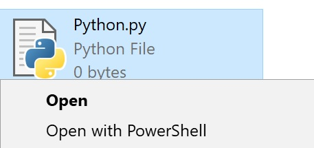

# Open with PowerShell for .py files

Add a right menu to make it more convinient to open a .py file with PowerShell
for Windows ONLY

## Installing

1. Download [here](openWithPowerShell.reg)
2. Run and Click YES!

## License

This project is licensed under the MIT License - see the [LICENSE.md](LICENSE.md) file for details